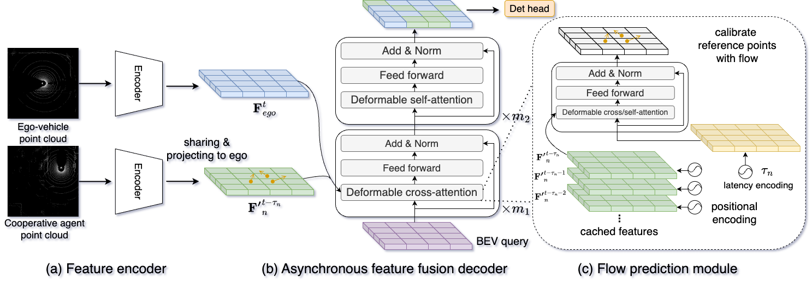
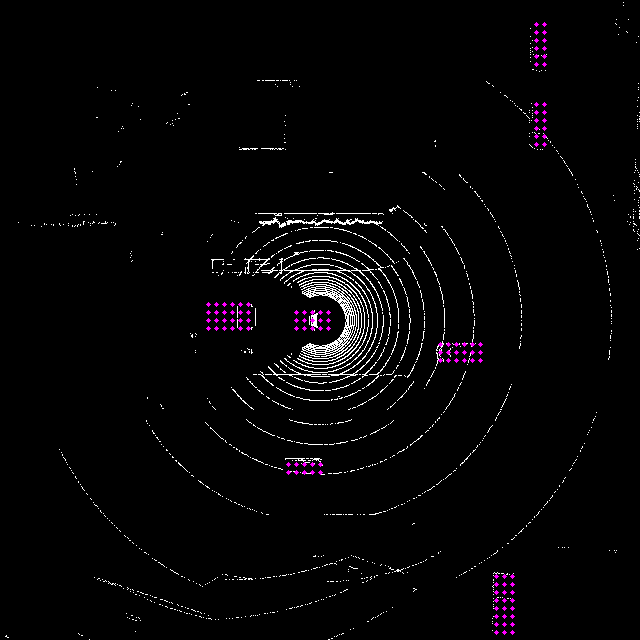
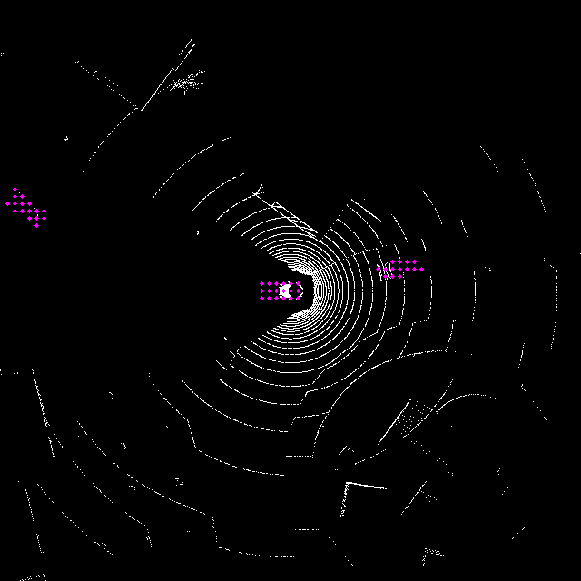

# Latency Robust Cooperative Perception using Asynchronous Feature Fusion(WACV2025)

Abstract: We propose a Latency Robust Cooperative Perception framework, named LRCP, to compensate for the effect of temporal asynchrony. The intuition of LRCP is to directly fuse asynchronous bird’s-eye view (BEV) features instead of estimating aligned features. To achieve this, we first propose a novel flow prediction module that uses cached past BEV features to predict the flow with a non-discrete time delay at the BEV feature level. Then, the predicted flow is employed to guide the spatial sampling location of interests. Our approach substantially enhances the robustness of temporal asynchronous cooperative perception.

<div align="left">
	
</div>

# Installation
This repository is based on [OpendCood.](https://opencood.readthedocs.io/en/latest/md_files/installation.html), please also refer the documents to install.
### prepare environment
```bash
# you may change the version based on your system
conda create --name LRCP python=3.8
conda activate LRCP
conda install pytorch==2.0.0 torchvision==0.15.1 cudatoolkit=11.8 -c pytorch -c conda-forge
```

### install LRCP

```bash
git clone https://github.com/JesseWong333/LRCP.git
cd LRCP
pip install -r requirements.txt
python setup.py develop

python opencood/utils/setup.py build_ext --inplace 
python opencood/pcdet_utils/setup.py build_ext --inplace 
```
### install spconv 1.2.1
please refer to https://github.com/traveller59/spconv


### Compiling deformable attention operators
```bash
cd ./opencood/utils/ms_deform_attn_ops
sh ./make.sh
# unit test (should see all checking is True)
python test.py
```

# Data Preparation
### V2x-sim
Download the datastes from https://ai4ce.github.io/V2X-Sim/download.html, select V2X-sim 2.0 full dataset.
The decompressed dataste should be organized like this:
```
├── v2xsim2
│   ├── lidarseg
│   ├── maps
│   ├── sweeps
│   └── v1.0-mini
```

#### Generate the v2xsim info files. 
You may download from [google drive](https://drive.google.com/file/d/1m5sODNYfoa1C2IMUR2QJvFanPV3fDVeb/view?usp=sharing).
``` bash
python v2x-sim_delay_pairs-generation.py  # please specify the downloaded dataset path
```

#### Generate the ground truth flow
``` bash
python flow_label_gen_v2x-smi.py # please specify the downloaded dataset path
```
Visualization of the flow
<div align="left">
	
    
</div>

#### Training

``` bash
# stage1: please specify your data path in the yaml file
python opencood/tools/train_w_delay.py --hypes_yaml ./opencood/hypes_yaml/v2xsim/pointpillar_deformable_attn_stage1.yaml

# stage2: please specify your data path and the stage1 model in the yaml file
python opencood/tools/train_w_delay.py --hypes_yaml ./opencood/hypes_yaml/v2xsim/pointpillar_deformable_attn_stage2.yaml
```

#### Evaluatin
``` bash
python opencood/tools/inference_w_delay.py  --model_dir ./opencood/logs/your_log_path, --fusion_method intermediate
```

### FAQ
1. If you want plan to reproduce the results on dair-V2X, please can download flow files from
https://drive.google.com/file/d/1GSQ-Un8zWw6Fyt1gs3vjm5iQuyCTpjb4/view?usp=share_link

## Acknowlege

This project is impossible without the code of [OpenCOOD](https://github.com/DerrickXuNu/OpenCOOD), [CoAlign](https://github.com/yifanlu0227/CoAlign), [Deformable DETR](https://github.com/fundamentalvision/Deformable-DETR).

### Citation
```bibtex
@inproceedings{wang2025latency,
  title={Latency Robust Cooperative Perception Using Asynchronous Feature Fusion},
  author={Wang, Junjie and Nordstr{\"o}m, Tomas},
  booktitle={2025 IEEE/CVF Winter Conference on Applications of Computer Vision (WACV)},
  pages={1--10},
  year={2025},
  organization={IEEE}
}
```

